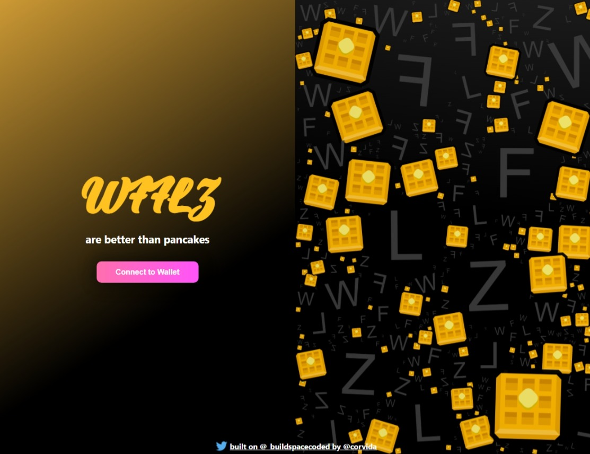

# 🧇 WFFLZ NFT Minting dApp 🧇

`"WFFLZ are better than pancakes" - bro`

An experimental dApp that mints WFFLZ NFTs on Solana. Connect your wallet and mint a WFFLZ NFT. **This is for learning purposes only** and the first of (hopefully) more Web3 experiments.

**Do not use real money/crypto to mint! Use devnet SOL only!**

Thanks to [\_buildspace](buildspace.so) for providing the starter files and tutorial to create my first dApp! Site design created by me.

**[[Demo](https://nft-drop-starter-project-rho.vercel.app/)]**

**\*Do not use real money/crypto to mint! Use devnet SOL only!**

### Built With:

- [Metaplex](https://www.metaplex.com/) (Collection of libraries, contracts, and tools to make creating and launching NFTs easy)
- [Candy Machine](https://docs.metaplex.com/candy-machine-v2/mint-frontend) (Metaplex tool to manage a "fair mint")
- [QuickNode](https://www.quicknode.com/) (RPC backup)
- Solana CLI (Blockchain)
- Arweave (Storage)
- React
- CSS3

### Lessons

**The most exciting parts of this project** were coming up with a frontend design and creating/minting NFTs (of course). Serious feelings of satisfaction spontaneously erupt throughout your whole body when you mint your first NFT, especially if said NFT is your own. Airdropping fake Solana to my wallet was pretty nice too 😏

**The most challenging parts of this project** were adding the logic for the Candy Machine (so much code 😵), extensive timeouts on Solana blockchain, and Firefox's CORS block setting. Wasted an hour trying to get around CORS and ended up finishing the last half of the project with Microsoft Edge 😮. It wasn't as bad as you might imagine. Used a trial for QuickNode to reduce timeouts using their RPC link.

**After finishing this project I felt** excited! This was quite the challenge, but that only made finishing the project even more empowering. Though some of this went over my head, I definitely plan to dig into more Web3 development and its intersection with frontend development. Most importantly, I had fun. 🤬 _all those timeout errors though._

### Author

- [Portfolio](https://corvida.netlify.app/)
- [Tech Blog](https://shegeeks.net)
- [@Corvida on Twitter](https://www.twitter.com/corvida)
